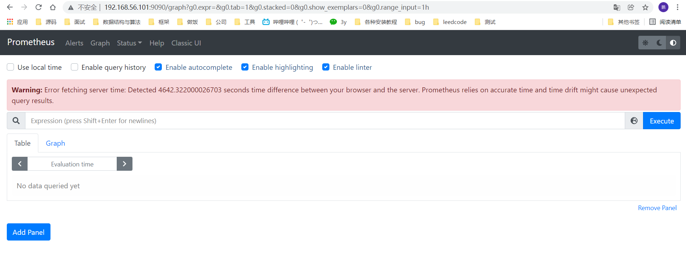

# Prometheus

​	

### Prometheus的安装和使用（docker版）

>下面介绍如何使用Prometheus和Grafana对本机服务器性能和jvm进行监测。
>
>监控本机，只需要一个exporter node_exporter – 用于机器系统数据收集
>
> Grafana是一个开源的功能丰富的数据可视化平台，通常用于时序数据的可视化。它内置了以下数据源的支持：
>
>下面是我们安装时用到的架构图：
>
>

* 下载镜像

```shell
docker pull prom/node-exporter #用于监视本机情况
docker pull prom/prometheus	   #用于搭建prometheus
docker pull grafana/grafana	   #用于搭建grafana
```

#### node-exporter监控本机

```shell
docker run -d -p 9100:9100 \
  -v "/proc:/host/proc:ro" \
  -v "/sys:/host/sys:ro" \
  -v "/:/rootfs:ro" \
  --net="host" \
  prom/node-exporter
  
```

* 等待几秒，查看端口是否起起来

```shell
[root@localhost prometheus]#  netstat -anpt
Active Internet connections (servers and established)
Proto Recv-Q Send-Q Local Address           Foreign Address         State       PID/Program name    
tcp        0      0 0.0.0.0:111             0.0.0.0:*               LISTEN      688/rpcbind         
tcp        0      0 0.0.0.0:22              0.0.0.0:*               LISTEN      986/sshd            
tcp        0      0 172.17.0.1:32982        172.17.0.5:10911        TIME_WAIT   -                   
tcp        0      0 172.17.0.1:32990        172.17.0.5:10911        TIME_WAIT   -                   
tcp        0      0 192.168.56.101:22       192.168.56.1:63395      ESTABLISHED 7311/sshd: root@pts 
tcp        0      0 172.17.0.1:59740        172.17.0.3:9876         ESTABLISHED 1961/docker-proxy   
tcp        0      0 172.17.0.1:32994        172.17.0.5:10911        TIME_WAIT   -                   
tcp        0      0 172.17.0.1:34056        172.17.0.3:9876         TIME_WAIT   -                   
tcp        0      0 172.17.0.1:34048        172.17.0.3:9876         TIME_WAIT   -                   
tcp        0      0 192.168.56.101:22       192.168.56.1:59357      ESTABLISHED 3100/sshd: root@pts 
tcp6       0      0 :::10911                :::*                    LISTEN      2354/docker-proxy   
tcp6       0      0 :::9100                 :::*                    LISTEN      14823/node_exporter 
```

* 访问9100端口，可以看到一堆信息，得到这些信息即可，可用于做数据展示

```
http://192.168.56.101:9100/metrics
```


#### 安装prometheus

* 先新建一个prometheus目录

```
mkdir /home/prometheus
cd /home/prometheus/
vim prometheus.yml
```

* 新建一个prometheus的yml配置文件

```shell
global:
  scrape_interval:     60s
  evaluation_interval: 60s
 
scrape_configs:
  - job_name: prometheus
    static_configs:
      - targets: ['localhost:9090']
        labels:
          instance: prometheus
 
  - job_name: linux
    static_configs:
      - targets: ['192.168.91.132:9100']
        labels:
          instance: localhost
```

* 启动prometheus

```shell
docker run  -d \
  -p 9090:9090 \
  -v /home/prometheus/prometheus.yml:/etc/prometheus/prometheus.yml \
  -v /etc/localtime:/etc/localtime \
  prom/prometheus
```

* 登录9090端口访问，发现出现错误，猜测时间不同步

```
http://192.168.56.101:9090/
```



* 解决bug，进入prometheus的容器中，查看时间和主机时间进行对比

```bash
[root@localhost ~]# docker exec -it 2be6 sh
/prometheus $ date
Tue Feb 22 05:17:01 UTC 2022
/prometheus $ exit
[root@localhost ~]# date
2022年 02月 22日 星期二 13:17:59 CST
```

* 因为这个问题，已经在建立rocket mq的时候遇到过了，所以解决起来非常快

```bash
docker run  -d \
  -p 9090:9090 \
  -v /home/prometheus/prometheus.yml:/etc/prometheus/prometheus.yml \
  -v /etc/localtime:/etc/localtime \
  prom/prometheus
```

！！！这里有个问题，不仅仅是你docker和虚拟机需要时间一致，虚拟机和你的主机时间也要一致，差53秒都不行，需要非常精确。

